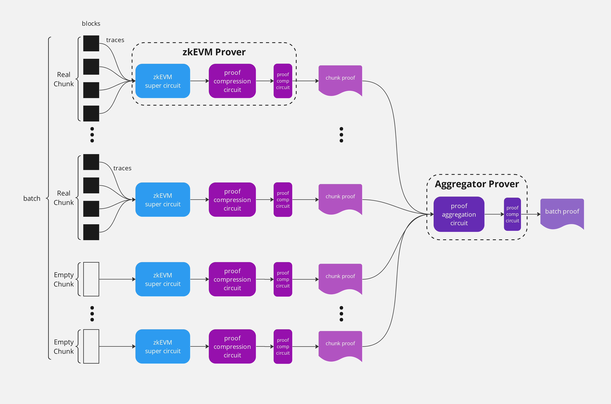
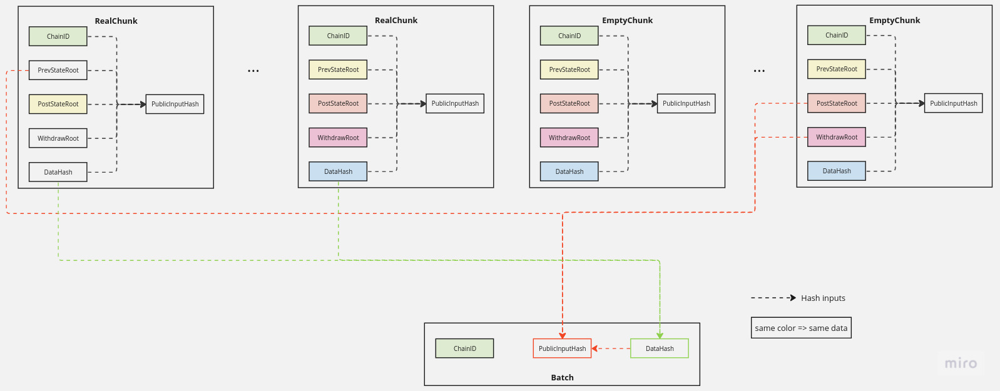
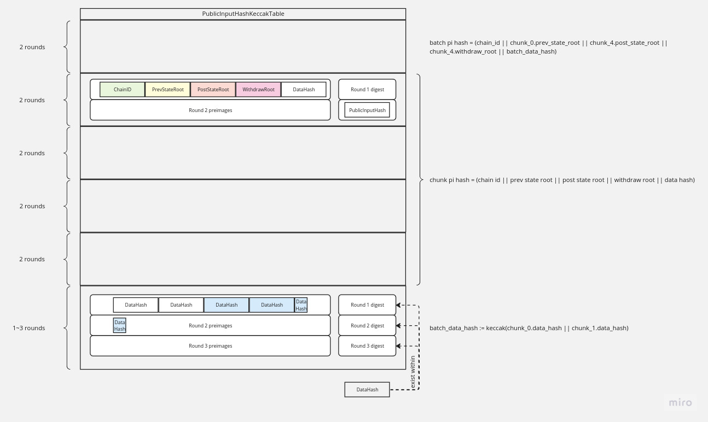

Proof Aggregation
-----


# Params
|param|meaning |
|:---:|:---|
|k | number of valid chunks|
|n | max number of chunks per batch|
|t | number of rounds for the final hash $\lceil32\times n/136\rceil$ |

Currently `n` is hard coded to `10`.
# Structs

## Chunk

A __chunk__ is a list of continuous blocks. It consists of 4 hashes:
- state root before this chunk
- state root after this chunk
- the withdraw root of this chunk
- the data hash of this chunk

Those 4 hashes are obtained from the caller.

The chunk's public input hash is 
```
chunk_pi_hash := keccak(chain_id || prev_state_root || post_state_root || withdraw_root ||  chunk_data_hash)
```

## Continuous chunks

A list of continuous chunks $c_1, \dots, c_k$ satisfy
```
c_i.post_state_root == c_{i+1}.prev_state_root
```
for $i \in [1, k-1]$.

## Padded chunk
A __padded chunk__ is a chunk that repeats the last valid chunk. It is used for padding. 
If $k< n$, $(n-k)$ padded chunks are padded to the list. A padded chunk has the same data fields as the last real chunk, and the parameters are set as
- state root before this chunk: `c_{k}.prev_state_root`
- state root after this chunk: `c_{k}.post_state_root`
- the withdraw root of this chunk: `c_{k}.withdraw_root`
- the data hash of this chunk: `c_{k}.data_hash`

## Batch

A __batch__ consists of continuous chunks of size `k`. If the input chunks' size `k` is less than `n`, we pad the input with `(n-k)` chunks identical to `chunk[k]`.

# Circuits

## Chunk circuit

Circuit proving the relationship for a chunk is indeed the zkEVM circuit. It will go through 2 layers of compression circuit, and becomes a __snark__ struct. We do not list its details here. Abstractly, a snark circuit has the following properties:
- it takes 44 elements as public inputs 
    - 12 from accumulators
    - 32 from public input hash




## Aggregation Circuit

We want to aggregate `k` snarks, each from a valid chunk. We generate `(n-k)` padded chunks, and obtain a total of `n` snarks. 

In the above example, we have `k = 2` valid chunks, and `2` padded chunks.

The padded snarks are identical the the last valid snark, so the aggregator does not need to generate snarks for padded chunks.

### Configuration

There will be three configurations for Aggregation circuit.
- FpConfig; used for snark aggregation
- KeccakConfig: used to build keccak table
- RlcConfig: used to compute RLC of hash inputs

### Public Input
The public input of the aggregation circuit consists of
- 12 elements from accumulator
- 32 elements of `batch_pi_hash`

### Statements
For snarks $s_1,\dots,s_k,\dots, s_n$ the aggregation circuit argues the following statements.

1. batch_data_hash digest is reused for public input hash. __Static__.

2. batch_pi_hash used same roots as chunk_pi_hash. __Static__.
```
batch_pi_hash   := keccak(chain_id || chunk_1.prev_state_root || chunk_n.post_state_root || chunk_n.withdraw_root || batch_data_hash)
```
and `batch_pi_hash` matches public input.

3. batch_data_hash and chunk[i].pi_hash use a same chunk[i].data_hash when chunk[i] is not padded

```
for i in 1 ... n
    chunk_pi_hash   := keccak(chain_id || prev_state_root || post_state_root || withdraw_root || chunk_data_hash)
```

This is done by computing the RLCs of chunk[i]'s data_hash for `i=0..k`, and then check the RLC matches the one from the keccak table.

4. chunks are continuous when they are not padded: they are linked via the state roots.

```
for i in 1 ... k-1
    c_i.post_state_root == c_{i+1}.prev_state_root
```

5. All the chunks use the same chain id. __Static__.
```
for i in 1 ... n
    batch.chain_id == chunk[i].chain_id
```

6. The last `(n-k)` chunk[i] are padding
```
for i in 1 ... n:
    if is_padding:
        chunk[i]'s chunk_pi_hash_rlc_cells == chunk[i-1].chunk_pi_hash_rlc_cells
```
This is done via comparing the `data_rlc` of `chunk_{i-1}` and ` chunk_{i}`.
7. the hash input length is correct
- first MAX_AGG_SNARKS + 1 hashes all have 136 bytes input
- batch's data_hash length is 32 * number_of_valid_snarks
8. batch data hash is correct w.r.t. its RLCs
9. is_final_cells are set correctly

### Handling dynamic inputs





Our keccak table uses $2^{19}$ rows. Each keccak round takes `300` rows. When the number of round is less than $2^{19}/300$, the cell manager will fill in the rest of the rows with dummy hashes. 

The only hash that uses dynamic number of rounds is the last hash. 
Suppose we target for `MAX_AGG_SNARK = 10`. Then, the last hash function will take no more than `32 * 10 /136 = 3` rounds. 

We also know in the circuit if a chunk is an empty one or not. This is given by a flag `is_padding`. 

For the input of the final data hash
- we extract `32 * MAX_AGG_SNARK` number of cells (__static__ here) from the last hash. We then compute the RLC of those `32 * MAX_AGG_SNARK` when the corresponding `is_padding` is not set. We constrain this RLC matches the `data_rlc` from the keccak table.

For the output of the final data hash
- we extract all three hash digest cells from last 3 rounds. We then constraint that the actual data hash matches one of the three hash digest cells with proper flags defined as follows.
    - if the num_of_valid_snarks <= 4, which only needs 1 keccak-f round. Therefore the batch's data hash (input, len, data_rlc, output_rlc) are in the first 300 keccak rows;
    - else if the num_of_valid_snarks <= 8, which needs 2 keccak-f rounds. Therefore the batch's data hash (input, len, data_rlc, output_rlc) are in the 2nd 300 keccak rows;
    - else the num_of_valid_snarks <= 12, which needs 3 keccak-f rounds. Therefore the batch's data hash (input, len, data_rlc, output_rlc) are in the 3rd 300 keccak rows;

|#valid snarks | offset of data hash | flags|
|---| ---| ---|
|1,2,3,4       | 0                   | 1, 0, 0|
|5,6,7,8       | 32                  | 0, 1, 0   |
|9,10          | 64                  | 0, 0, 1|

Additional checks for dummy chunk
- if `is_padding` for `i`-th chunk, we constrain `chunk[i]'s chunk_pi_hash_rlc_cells == chunk[i-1].chunk_pi_hash_rlc_cells`
