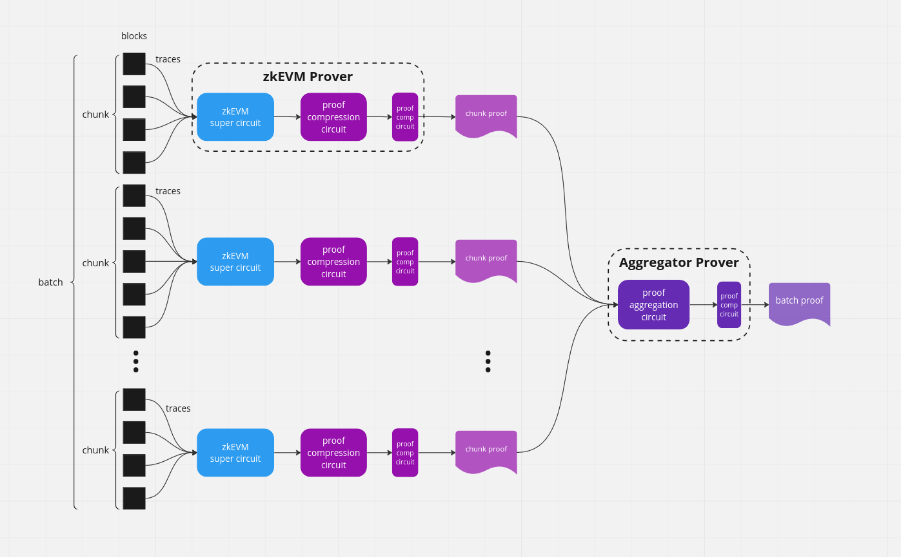

Proof Aggregation
-----

This repo does proof aggregations for zkEVM proofs.

## zkEVM circuit
A zkEVM circuits generates a ZK proof for a chunk of blocks. It takes 64 field elements as its public input, consist of 
- chunk's data hash digest: each byte is encoded in an Fr element
- chunk's public input hash digest: each byte is encoded in an Fr element
The total size for a public input is 64 bytes, encoded in 64 Fr element

For the ease of testing, this repo implements a `MockCircuit` which hash same public input APIs as a zkEVM circuit. 

## First compression circuit
The first compression circuit takes in a fresh snark proof and generates a new (potentially small) snark proof. 
The public inputs to the new snark proof consists of 
- 12 elements from the accumulators
    - an accumulator consists of 2 G1 elements, which are the left and right inputs to the pairing
    - this is treated as 4 Fq elements, each decomposed into 3 limbs and encoded in Fr  
- 64 elements from previous snark
    - re-expose the same public inputs as the original snark

The first compression circuit is configured [wide config file](./configs/compression_wide.config).

## Second compression circuit

The second compression circuit takes in a compressed snark proof and generates a new (potentially small) snark proof. 
The public inputs to the new snark proof consists of 
- 12 elements from the accumulators
    - an accumulator consists of 2 G1 elements, which are the left and right inputs to the pairing
    - this is treated as 4 Fq elements, each decomposed into 3 limbs and encoded in Fr  
    - accumulator from the previous snark is accumulated into the current accumulator
- 64 elements from previous snark
    - skipping the first 12 elements which are previous accumulator, as they are already accumulated
    - re-expose the rest 64 field elements as the public inputs 

The second compression circuit is configured [thin config file](./configs/compression_thin.config).

## Aggregation circuit
An aggregation circuit takes in a batch of `k` proofs, each for a chunk of blocks. 
It generates a single proof asserting the validity of all the proofs. 

It also performs public input aggregation, i.e., reducing the `64k` public elements  into a fixed number of `144` elements:
- 12 elements from accumulators, which accumulates all the previous `k` accumulators from each snark
- 132 elements from the hashes
    - first_chunk_prev_state_root: 32 Field elements
    - last_chunk_post_state_root: 32 Field elements
    - last_chunk_withdraw_root: 32 Field elements
    - batch_public_input_hash: 32 Field elements
    - chain_id: 8 Field elements

In addition, it attests that, for chunks indexed from `0` to `k-1`,
- batch_data_hash := keccak(chunk_0.data_hash || ... || chunk_k-1.data_hash) where chunk_i.data_hash is a public input to the i-th batch snark circuit
- chunk_pi_hash := keccak(chain_id || prev_state_root || post_state_root || withdraw_root || chunk_data_hash) where chunk_data_hash is a public input to the i-th batch snark circuit
- and the related field matches public input

See [public input aggregation](./src/proof_aggregation/public_input_aggregation.rs) for the details of public input aggregation.