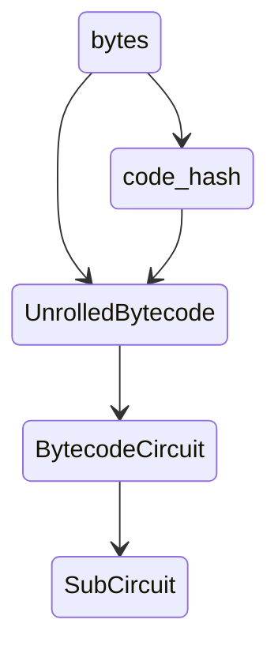

# Bytecode Circuit

code: https://github.com/scroll-tech/zkevm-circuits/blob/develop/zkevm-circuits/src/bytecode_circuit.rs `develop` branch

## The Bytecode table

The EVM Circuit needs to lookup to the bytecode table that stores the correct bytecode information. This ensures that the bytes stored in the contract are the same as the bytes loaded in the table. The bytecode table has the following table layout:

|codehash|tag (u64)|index|is_code|value|
|-|-|-|-|-|
|RLC of hash's little-endian bytes using evm_word randomness|BytecodeFieldTag::Header|0|0|len of bytes|
|RLC of hash's little-endian bytes using evm_word randomness|BytecodeFieldTag::Byte|idx|true when the byte is not an argument to a PUSHx instruction|byte|

Here `Header` is used to seperate bytecodes.

## Purpose of the Bytecode Circuit

The bytecode circuit aims at constraining the correctness of the above bytecode table. This includes:
- constraints related to boundary behavior of tag: first and last row constraints, transition from `tag==byte` to `header` and vice versa, transition from `header` to `header`; 
- constrain the code size: this includes counting the length of the bytecode by constraining the index at the end byte of a bytecode;
- constrain the code hash: correct behavior of RLC of bytes in code hash and lookup to Keccak table for codehash;
- ensure PUSH behavior: `is_code = push_data_left == 0` (so must be boolean) and lookup `push_table` for PUSH1-PUSH32 to ensure push data size;
- correct propagation of each row within one bytecode


## Architecture and Design

Raw `bytes` with the Keccak codehash of it `code_hash=keccak(&bytes[...])` are feed into `unroll_with_codehash` that runs over all the bytes and unroll them into `UnrolledBytecode{bytes, rows}`, which fits the bytecode table layout. This means each row contains `(code_hash, tag, index, is_code, value)`. (The only difference is that here `code_hash` is not RLCed yet.) Notice that only `PUSHx` will be followed by non-instruction bytes, so `is_code = push_rindex==0`, i.e. `unroll_with_codehash` computes `push_rindex` that decays from push size to zero and when it is zero it means the byte is an instruction code. With `UnrolledBytecode`, we contrain its rows via `BytecodeCircuit`, so the architecture looks like



## Circuit Layout

The `BytecodeCircuit` is configured using the following columns, (internal and external) tables, as well as chips (which are just smaller-sized circuits):

```markmap
# BytecodeCircuitConfig
## fixed columns
### q_enable
### q_first
### q_last
## advice columns
### push_data_left
### value_rlc (i.e. hash_input_rlc)
### length (i.e. code_length)
### push_data_size
### push_data_left_inv
### index_length_diff_inv
## internal tables (within zkevm-circuits)
### bytecode_table
### push_table
## external tables
### keccak table
## chips
### IsZero
- push_data_left_iszero
- length_length_diff_iszero
```

Here
- `q_first` and `q_last` are selectors that determine the first and the last bytecode;
- `push_data_left` stands for the reverse byte index of push, i.e. it decays from `push_data_size` to 0 during each push operation; `push_data_size` is the length of push data; `push_data_left_inv` and `    push_data_left_is_zero` are used to check if `push_data_left` is 0;
- `length` stands for the length of the current bytecode; `index_length_diff_inv`, `index_length_diff_is_zero` are used to check whether `index+1` and `length` are the same at the final byte of a bytecode;
- `value_rlc` is the RLC of the input bytes using keccak_input_randomness (a `SecondPhase`  randomness, i.e. generated after `FirstPhase` of the proof, currently the same as evm_words randomness)
- `push_table` is a 2-column lookup table constructed internally inside Bytecode Circuit using method `load_aux_tables`. It is a mapping `BYTE -> NUM_PUSHED`, where for `byte < OpcodeId::PUSH1 -> 0`, for `byte >= OpcodeId::PUSH1 and byte <= OpcodeId::PUSH32 -> [1..32]` and for `byte > OpcodeId::PUSH32 and byte < 256 -> 0`.

`BytecodeCircuitConfig` uses `assign_internal` and `set_row` to assign `witness: &[UnrolledBytecode<F>]` into `BytecodeCircuit`. The padding rows are assigned with `tag=header`, `code_hash` to be the empty code hash (specifically defined), and other columns of the bytecode table to be 0.


## Constraints

- constraints related to boundary behavior of `tag`
    - `tag` is `header` for `q_first` or `q_last` is 1
    - when `tag` is `header` then `index=0` and `value=length`
    - when `tag` transits from `header` to `header` or `q_last==1`, then `length=0` and `code_hash=EMPTY_HASH`
    - when `tag` transits from `header` to `byte`, then start a new bytecode, with initialized `index=0`, `is_code=1` and `code_hash`, `value` (RLC) and `length`
    - at the end of a bytecode, i.e. `index+1=length`, change `tag` to `header`

- constraints related to code size
    - when `tag` transits from `byte` to `header`, then constrain that `index+1=length`

- constraints related to code hash
    - when `tag` transits from `byte` to `header` and `q_last==0`, then lookup to the Keccak table for `(value_rlc, length, hash)`

- constraints related to PUSH behavior
    - when `tag` is `byte`, then `is_code = push_data_left==0`
    - when `tag` is `byte`, then lookup to push_table for `(value, push_data_size)`

- correct propagation of each row within one bytecode
    - when `tag` transits from `byte` to `byte`, then `length` and `hash` remain the same, `index` increse by 1, `value_rlc` accumulates, and for push data `push_data_left` decay by 1, for code `push_data_left` remains the same as `push_data_size`

