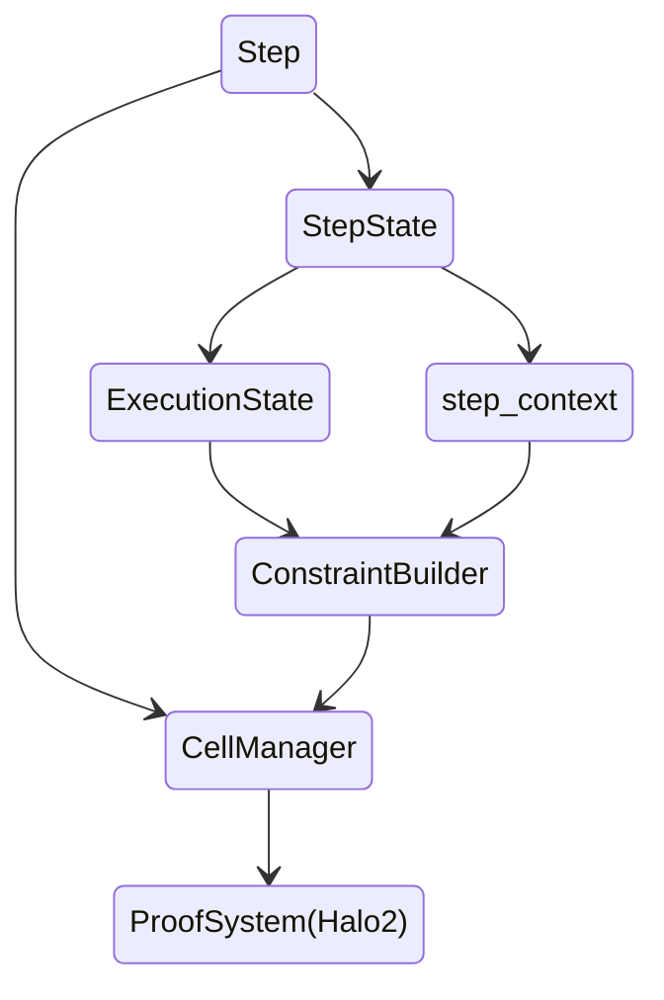

# EVM Circuit

code: https://github.com/scroll-tech/zkevm-circuits/blob/develop/zkevm-circuits/src/evm_circuit.rs `develop` branch.

link to the original HackMD file: https://hackmd.io/@dieGzUCgSGmRZFQ7SDxXCA/BJF7RZad2

[Ethereum Virtual Machine]: https://ethereum.org/en/developers/docs/evm/

[opcodes]: https://www.evm.codes/?fork=shanghai

[go-ethereum]: https://geth.ethereum.org/

## Purpose and Design

The [Ethereum Virtual Machine] (EVM) is a state machine that defines the rules of valid state transition in the Ethereum protocol. This means that it specifies a deterministic function under which the next valid EVM state is computed from the current EVM state. The execution part of EVM uses [opcodes] to realize these state transitions, which results in an <i>Execution trace</i>.


The execution trace consists of each step of execution defined by the opcode. EVM Circuit aims at constructing a constraint system corresponding to this execution trace, that can be proved by some backend zk-proof system such as Halo2. 

The high-level design idea of EVM Circuit is somewhat reminiscent of the design of EVM itself (such as [go-ethereum]). In go-ethereum, an `Intepreter` loops over all instruction opcodes along the execution trace. At each instruction, the `Intepreter` helps to check relevant context information such as gas, stack, memory etc., and then sends the opcode to a `JumpTable` from which it fetches detailed `operation` that this opcode should do. 

Analogously, in EVM Circuit, we build <i>execution steps</i> according to the steps in the execution trace, with witnesses for both the opcode and the execution context. For each execution step, a set of constraints is imposed to check context information. For each opcode, a set of constraints is imposed to check the opcode's behavior. Within an execution trace, the same opcode should have the same constraints. We use a selector to "turn on" all steps for the same opcode within a trace and we prove their behavior using our backend proof system. This is possible thanks to how our backend proof system (Halo2) works. The overall proof is obtained by applying this scheme to the list of all opcodes that appear in the execution trace.


## Architecture

We decompose the execution trace into execution steps and impose constraints for each step/step state transition. A `Step` contains two parts: `StepState` carries the execution step and its context information; and `CellManager` helps to fill the step's information as witnesses into the circuit's cells. An API layer `ConstraintBuilder` is built upon the backend proof system (Halo2) to impose constraints. The overall architecture looks as follows:




### Step and StepState

A `Step` consists of the `StepState` and `CellManager`. We characterize each execution by its `StepState` consisting of the following components:

```markmap
# Step
## StepState
### execution_state
 - InternalState
     - BeginTx
     - EndTx
     - EndBlock
 - OpcodeSuccessfulStates
     - STOP
     - ADD_SUB
     - ...
 - ErrorCases
     - ErrorInvalidOpcode
     - ErrorStack
     - ...
### step_context 
 - rw_counter
 - call_id
 - tx_id
 - is_root
 - is_create
 - block_number
 - code_hash
 - program_counter
 - stack_pointer
 - gas_left
 - memory_word_size
 - reversible_write_counter
 - log_id
## CellManager
```

### ConstraintBuilder

An API layer `constraint_builder` is developed on top of the backend proof system to build constraint expressions for each execution step/step state transition, including custom gates and plookups:

```markmap
## ConstraintBuilder
### add_constraint
- require_equal
- require_zero
- require_in_set
- ...
### add_lookup
- range_lookup
- opcode_lookup
- bytecode_lookup
- tx_context_lookup
- rw_lookup
- ...
### split_expression (used to split high degree expression to deg 2)
### store_expression (store those splitted expressions)
### build
- constraints
    - curr step constraints
    - first step constraints
    - last step constraints
    - not last step constraints
- stored expressions
- curr step height
```

### CellManager

The backend proof system is based on Halo2, so all constraints are implemented as Halo2 custom gates and plookups. We use `CellManager` to configure geometric layout of Halo2 cells that settle our constraints within an execution step. 

#### CellTypes

`Challenge` API is a feature of Halo2 that can produce SNARK's random challenges based on different phases of the proof in the transcript. In alignment with the `Challenge` API, EVM Circuit classifies its cells based on different phases of the proof. This results in `CellType`, which currently contains `StoragePhase1`, `StoragePhase2`, `StoragePermutation` and `Lookup` for different types of lookup tables, etc. . A given column in EVM Circuit will consist of cells with the same `CellType`. Columns under a given `CellType` will be horizontally layouted in a consecutive way to occupy a region. Cells that are of the same `CellType` will be subject to the same random challenge produced by `Challenge` API when a Random Linear Combination (RLC) is applied to them.

#### Behavior of CellManager within columns of the same CellType

When inserting a new cell into a region consisting of columns that are restricted to a specific `CellType`, say `CellType::Lookup` cells that are for one particular lookup table, `CellManager` always adds the new cell to the column with the shortest current height of inserted cells (columns that do not have inserted cells have height 0). If there are multiple cells to be inserted, we just iterate the above behavior. So this induces a "row by row" queries of cells, see figure below:


#### Behavior of CellManager across columns of different CellTypes

When different regions with different `CellType` have inserted cells that occupy different heights, `CellManager` results in the figure below:


### ExecutionGadget

`ExecutionGadget` is a trait that will be implemented for each execution step that corresponds to an opcode. We often combine several opcodes with similar functionality into one `ExecutionGadget`. `ExecutionGadget` contains two methods: 
- `configure`, which is to set constraints for this execution step; 
- `assign_exec_step`, which is used to fill in witness values into the circuit. 


## Circuit Layout

At each step, we enable 3 selector columns: 
- `q_usable`, if this step is a step that is actually used in execution;
- `q_step_first`, if this step is the first execution step;
- `q_step_last`, if this step is the last execution step. 
 
Then we enable an advice column:

- `q_step`,  the dynamic selector for the start of this execution step since the witnesses of each execution step may occupy variable height in the circuit layout. 

A few extra columns are enabled for various purposes, including:

- `constants`, a fixed column, hold constant values used for copy constraints
- `num_rows_until_next_step`, an advice column, count the number of rows until the next step
- `num_rows_inv`, an advice column, for a constraint that enforces `q_step:= num_rows_until_next_step == 0`

In alignment with the `Challenge` API of Halo2, we classify all the above columns as in phase 1 columns using Halo2's phase convention.

After that, a rectangular region of advice columns is arranged for the execution step specific constraints that correspond to an `ExecutionGadget`. The width of this region is set to be a constant `STEP_WIDTH`. The step height is not fixed, so it is dynamic. This part is handled by `CellManager`. 

For each step, `CellManager` allocates an area of advice columns with a given height and the number of advice columns as its width. The allocation process is in alignment with `Challenge` API. So within the area allocated to advice columns, `CellManager` marks columns in consecutive regions from left to right as

- `CellType::Lookup(Table)`: used for lookups. The type of lookups used inside evm-circuit are configured in `LOOKUP_CONFIG`, currently containing 
    - `Fixed` (corresponding to the fixed table), 
    - `Tx` (corresponding to the tx table), 
    - `Rw` (corresponding to the read-write table), 
    - `Bytecode` (corresponding to the bytecode table), 
    - `Block` (corresponding to the block table), 
    - `Copy` (corresponding to the copy table), 
    - `Keccak` (corresponding to the Keccak table), 
    - `Exp` (corresponding to the exp table), 
    - `Sig` (corresponding to the tx sign-verify table). 
For each type of lookup cells, `LOOKUP_CONFIG` sets its number of columns used inside EVM Circuit. Note: the number of columns inside EVM Circuit for each lookup type cells is <i>not</i> the number of columns used in the corresponding lookup table. This will be explained in detail in a later section "<b>Lookup Tables</b>"; 
- `CellType::StoragePermutationPhase2`: used for copy constraints on phase 2, and number of columns `N_PHASE2_COPY_COLUMNS`;
- `CellType::StoragePhase2`: used for phase 2 constraints, and number of columns `N_PHASE2_COLUMNS-N_PHASE2_COPY_COLUMNS`;
- `CellType::StoragePermutation`: used for copy constraints, and number of columns `N_COPY_COLUMNS`;
- `CellType::LookupByte`: used for byte lookup, and number of columns `N_BYTE_LOOKUPS`;
- `CellType::StoragePhase1`: used for phase 1 constraints, all the rest columns within `STEP_WIDTH` number of all advice columns.

Summarizing, the overall circuit layout for one particular step looks like 


An example of the evm-circuit fills in the following witnesses:

|`q_usable`|`q_step_first`|`q_step_last`|`q_step`|`constants`|`num_rows_until_next_step`|`num_rows_inv`|Gadget Specific Witnesses (128 columns maximum)|
|-|-|-|-|-|-|-|-|
|1|1|0|1|...|5|1/5|...|
|1|1|0|0|...|4|1/4|...|
|1|1|0|0|...|3|1/3|...|
|1|1|0|0|...|2|1/2|...|
|1|1|0|0|...|1|1|...|
|1|1|0|0|...|0|$\infty$|...|
|1|0|0|1|...|6|1/6|...|
|1|0|0|0|...|5|1/5|...|
|1|0|0|0|...|4|1/4|...|
|1|0|0|0|...|3|1/3|...|
|1|0|0|0|...|2|1/2|...|
|1|0|0|0|...|1|1|...|
|1|0|0|0|...|0|$\infty$|...|...|...|...|...|...|...|...|...|
|1|0|1|1|...|3|1/3|...|
|1|0|1|0|...|2|1/2|...|
|1|0|1|0|...|1|1|...|
|1|0|1|0|...|0|$\infty$|...|
|0|0|0|0|padding|padding|padding|padding|

The constraints for opcode specific `ExecutionGadget` are classified according to the selectors corresponding to `q_step`, `q_step_first`, `q_step_last` and `not_q_step_last`. These constraints are built in `ConstraintBuilder::build`, in which each gadget's specific constraints are multiplied by the selector for this particular execution state. 


## Lookup Tables 

### Logistics

During the proof of an execution step, we sometimes use lookup type arguments to verify the correctness of the EVM behavior generated at execution. The rationale is that if we can find a recorded item in a lookup table that is equal to the current EVM behavior that we want to constrain, we assert the latter's correctness. 

For example, when stack push/pops a stack element, we lookup the rw table (read-write table) for the correct stack read/write behavior. Another example is the bytecode table that we can lookup to verify the correctness of bytecode stored in the contract.

For the EVM Circuit, there are internal and external lookup tables. We summarize them as follows (table columns may change due to frequent modifications to the codebase):

- EVM Circuit internal lookup tables

|Lookup Table|Columns|
|-|-|
|Fixed|tag, value1, value2, value3|
|Byte|value|

- EVM Circuit external lookup tables

|Lookup Table|Columns|
|-|-|
|TxTable|tx_id, tag, index, value|
|RwTable|is_counter, is_write, tag, id, address, field_tag, storage_key, value, value_prev, aux1, aux2|
|BytecodeTable|code_hash, tag, index, is_code, value|
|BlockTable|tag, index, value|
|CopyTable|is_first, src_id, src_tag, dst_id, dst_tag, src_addr, src_addr_end, dst_addr, length, rlc_acc, rw_counter, rw_inc|
|KeccakTable|is_enabled (=1), input_rlc, input_len, output_rlc|
|ExpTable|is_step (=1), identifier, is_last, base_limbs[0], base_limbs[1], base_limbs[2], base_limbs[3], exp_lo_hi[0], exp_lo_hi[1], exponentiation_lo_hi[0],  exponentiation_lo_hi[1]|
|SigTable|msg_hash_rlc, sig_v, sig_r_rlc, sig_s_rlc, recovered_addr, is_valid|


### How lookups are configured in EVM Circuit's layout

#### Lookup into the table

We use `Lookup::input_exprs`  method to extract input expressions from an EVM execution trace that we want to do lookup, and we use `LookupTable::table_exprs` method to extract table expressions from a recorded lookup table. The lookup argument aims to prove that the former expression lies in the latter ones. This is done by first RLC (Random Linear Combine) on both sides of expressions using the same random challenge and then lookup the RLC expression. Here each column of a lookup table corresponds to one lookup expression, and EVM Step's lookup input expressions must correspond to the table expressions. See the following illustration:


At the execution level, the input expression RLCs enter EVM Circuit's lookup cell, and the RLCs with the same random challenge are done for the corresponding table expressions. The `ExecutionConfig`'s `config_lookup` method configures the lookup between the input expression RLCs and the table expression RLCs.

#### Lookup Cells in EVM Circuit

At each step, `CellManager` allocates a region with columns consisting of `CellType::Lookup(table)` that are for various types of lookups. Cells in these columns are filled with the RLC result of input expressions induced by the execution trace. This is done by the `add_lookup` method in `ConstraintBuilder`. 

The number of columns allocated for one type of lookup (the corresponding lookup will be into a particular lookup table) follows the configuration setting in `LOOKUP_CONFIG`. These numbers are tunable in order to make the circuit more "compact", i.e., with less unused cells, so that performance can be improved.

#### Challenge used for EVM Circuit's lookup cells

The random challenge used to obtain the RLC result of lookup's input expressions is given by `lookup_input`, which is obtained from `meta.challenge_usable_after(SecondPhase)`. So this random number is generated by the proof transcript after the second phase (i.e. phase 3). Notice that the input expressions (or table expressions) themselves can be RLC results. For example, Keccak table has columns of `input_rlc` and `output_rlc`. These RLC results are obtained using random challenges obtained in previous phases (such as phase 1 and phase 2). Therefore, the overall RLC results filled in an EVM Circuit's lookup cell may be the result of nested RLCs.

## Constraints 

Due to page limit we only discuss some examples here.

### General Constraints

#### `SameContextGadget`

This gadget is applied to every execution step in order to check the correct transition from the current state to the next state. The constraints include
- lookup to Bytecode Table and Fixed Table (with `tag=FixedTableTag::ResponsibleOpcode`) for the correctness of the current opcode;
- check remaining gas is sufficient;
- check correct step state transition, such as change of `rw_counter`, `program_counter`, `stack_pointer` etc.

### Opcode Constraints 

[ETH Yellow Paper]: https://ethereum.github.io/yellowpaper/paper.pdf

#### `mulmod`

According to the [ETH Yellow Paper], the MULMOD opcode (modulo addition operation) pops $3$ EVM words $\mu_{s}[0]$, $\mu_{s}[1]$, $\mu_{s}[2]$ each with 256-bit (32 byte) size from the stack and push back one EVM word $\mu_{s}'[0]$. 

To make our notations simpler, we denote $a=\mu_{s}[0]$, $b=\mu_{s}[1]$ and $n=\mu_{s}[2]$ and $r=\mu_{s}'[0]$, then the EVM behavior of MULMOD opcode can be viewed as a mapping 
```math
(a, b, n)\stackrel{\text{MULMOD}}{\rightarrow}  
r=\left\{\begin{array}{ll} 
0 & \text{ if } n=0 \ ,
\\
a\cdot b \mod n & \text{ if } n\neq 0 \ .
\end{array}\right.
```
The intermediate calculation is the multiplication of two $32$-byte words $a$ and $b$, and this operation is supposed to be <i>not</i> subject to $2^{256}$ modulo. 

Of course, a full characterization of the EVM behavior under MULMOD also involves the correct stack push-pop: $3$ stack pops and $1$ stack push, and together with a gas cost of $8$.

For the MULMOD opcode, EVM Circuit assigns $(a, b, n, r, k, a_{\text{reduced}}, d, e)$, each of which is 32-byte word:

```math
\begin{array}{rl}
a & =\overline{a_0a_1...a_{31}}=\sum\limits_{i=0}^{31} a_i \cdot 256^i \ ,
\\
b & =\overline{b_0b_1...b_{31}}=\sum\limits_{i=0}^{31} b_i\cdot 256^i \ , 
\\
n & =\overline{n_0n_1...n_{31}}=\sum\limits_{i=0}^{31} n_i\cdot 256^i \ , 
\\
r & =\overline{r_0r_1...r_{31}}=\sum\limits_{i=0}^{31} r_i\cdot 256^i \ ,
\\
a_\text{reduced} & =\overline{a_{r0}...a_{r31}}=\sum\limits_{i=0}^{31}a_{ri}\cdot 256^i \ ,
\\
d & =\overline{p_0p_1...p_{31}}=\sum\limits_{i=0}^{31} p_i\cdot 256^i \ ,
\\
e & =\overline{p_{32}p_{33}...p_{63}}=\sum\limits_{i=0}^{31} p_{32+i} \cdot 256^i \ ,
\\
k & =\overline{k_0k_1...k_{31}}=\sum\limits_{i=0}^{31} k_i \cdot 256^i \ .
\end{array}
```

It also assigns $\verb#n_sum#=n_0+...+n_{31}$.

Then the constraints are

- $a_\text{reduced} 
== a\mod n \ \text{ if } n\neq 0
\text{ and } a_\text{reduced} == 0 \text{ if } n=0$ (ModGadget); 
- $a_\text{reduced}\cdot b + 0  == d\cdot 2^{256} + e$ (MulAddWords512Gadget);
- $k\cdot n + r == d\cdot 2^{256} + e$ (MulAddWords512Gadget);
- `1 - 1(r<n) - 1(n_sum=0) == 0` (IsZeroGadget, LtWordGadget);
- `SameContextGadget`
    - opcodeID checks: opId $==$ OpcodeId(0x09);
    - state transition: rw_counter +4; stack\_pointer +2; pc +1; gas - op_cost;
    - Lookups: $4$ busmapping lookups: $a=\mu_{s}[0]$, 
$b=\mu_{s}[1]$, $n=\mu_{s}[2]$, 
$r=\mu_{s}'[0]$;
    - Exceptions: 
        - 1. stack undeflow: $1022 \leq$ stack\_pointer $\leq 1024$; 
        - 2. out of gas: Remaining gas is not enough.


#### `returndatacopy`

According to the [ETH Yellow Paper], the RETURNDATACOPY opcode pops 3 stack elements $\mu_{s}[0]$=`dest_offset`, $\mu_{s}[1]$=`data_offset` and $\mu_{s}[2]$=`size`. It copies output data from the previous call to memory. The copied output data starts from `data_offset` within return data from last call and memory copy starts from `dest_offset`, with copy data size equal to `size`. Denote by $\mu'_m$ the updated memory state and $\mu_o$ the return data from last call, then the rule is given by the following formula
```math
\forall i\in \{0... \boldsymbol{\mu}_{\textbf{s}}[2]-1\}: \boldsymbol{\mu}_{\textbf{m}}'[\boldsymbol{\mu}_{\textbf{s}}[0]+i]=\left\{
\begin{array}{ll}
\boldsymbol{\mu}_{\textbf{o}}[\boldsymbol{\mu}_{\textbf{s}}[1]+i] & \text{ if } \boldsymbol{\mu}_{\textbf{s}}[1]+i<\|\boldsymbol{\mu}_{\textbf{o}}\|
\\
0 & \text{ otherwise .}
\end{array}
\right.
```
Note that the data to be copied to memory that exceeds return data size ($||\mu_{o}||$) will be padded by 0.

For RETURNDATACOPY opcode, EVM Circuit does the following type of constraint checks together with witness assignments:

- Constraints for stack pop of `dest_offset`, `data_offset` and `size`. This means they are assigned from the step's rw data (via bus mapping) and then they are checked by doing RwTable lookups with `tag=RwTableTag::Stack`, as well as verifying the correct stack pointer update;
- Constraints for call context related data including `last_callee_id`, `return_data_offset` (offset for $\mu_{o}$) and `return_data_size` ($\|\mu_o\|$). These are assigned and then checked by RwTable lookups with `tag=RwTableTag::CallContext`. Here return data means the output data from last call, from which we fetch data that is to be copied into memory;
- Constraints for ensuring no out-of-bound errors happen with `return_data_size`;
- Constraints for memory related behavior. This includes memory address and expansion via `dest_offset` and `size`, as well as gas cost for memory expansion;
- Constraints for copy behavior. This is done by lookup to CopyTable with `src_id=last_callee_id` (source call id) and `dst_id=` current step call id (destination call id), and corresponding source and destination addresses determined by `return_data_offset`, `return_data_size`, `data_offset`, `dest_offset` and `size` (that computes destination memory address);
- `SameContextGadget`
    - opcodeID checks: opId $==$ OpcodeId(0x3e);
    - state transition: rw_counter+, stack\_pointer+3, pc+1, gas -(op_cost+memory expansion cost), memory expand to next memory word size.
 
