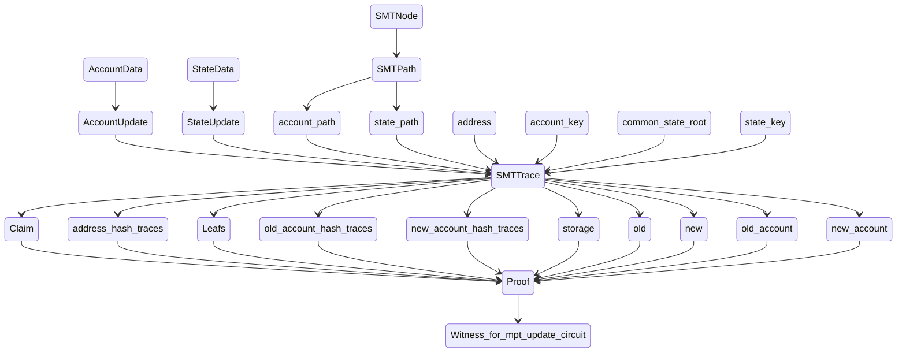

# MPT Circuit

code: https://github.com/scroll-tech/mpt-circuit `v0.4` branch.

[zkTrie spec]: https://github.com/scroll-tech/zktrie/blob/main/docs/zktrie.md

[zkevm-circuits]: https://github.com/scroll-tech/zkevm-circuits

[zkTrie]: https://github.com/scroll-tech/zkevm-circuits/tree/develop/zktrie

## MPT table 

[Merkle Patricia Tree](https://ethereum.org/en/developers/docs/data-structures-and-encoding/patricia-merkle-trie/) is one of the key data structures used in Ethereum's storage layer. In our [zkevm-circuits], we modify the original MPT into [zkTrie], which is essentially a sparse binary Merkle Patricia Trie. A detailed description of zkTrie can be found in this [zkTrie spec]. In the below, to align with the naming in the codebase, we will use the terms "MPT" or "trie" to refer to the zkTrie (instead of the originally defined MPT as in Ethereum). 

In zkevm-circuits, we use [MPT table](https://github.com/scroll-tech/zkevm-circuits/blob/700e93c898775a19c22f9abd560ebb945082c854/zkevm-circuits/src/table.rs#L680) to track step by step the state transitions from MPT operations. The MPT table has the following table layout

|q_enable|address|storage_key|proof_type|new_root|old_root|new_value|old_value|
|-|-|-|-|-|-|-|-|
|||actually the RLC of `storage_key` in little-endian bytes|[MPTProofType](https://github.com/scroll-tech/zkevm-circuits/blob/700e93c898775a19c22f9abd560ebb945082c854/zkevm-circuits/src/table.rs#L645)|||||

In the above, each row of the MPT table reflects an update to the MPT ([MPTUpdate](https://github.com/scroll-tech/zkevm-circuits/blob/700e93c898775a19c22f9abd560ebb945082c854/zkevm-circuits/src/witness/mpt.rs#L15)). The columns `address` and `storage_key` indicate the location where changes in account or storage happen. The change in value for this update are recorded in `old_value` and `new_value`, and the corresponding change of the trie root are recorded in `old_root` and `new_root`.

For each row's corresponding MPT update, we will prove its correctness in the MPT circuit that we describe below. To facilitate this, we record the MPTProofType in the above table, which corresponds to the following proof types:

- `MPTProofType`
    - `NonceMod`: Nonce updated
    - `BalanceMod`: Balance updated
    - `KeccakCodeHashExists`: Keccak Code hash exists 
    - `PoseidonCodeHashExists`: Poseidon Code hash exists 
    - `CodeSizeExists`: Code size exists
    - `NonExistingAccountProof`: Account does not exist
    - `StorageMod`: Storage updated
    - `NonExistingStorageProof`: Storage does not exist

## The purpose of MPT circuit and encoding of MPT updates via `SMTTrace`

MPT circuit aims at proving the correctedness of the MPT table described above. This means its constraint system enforces a unique change of MPT for each of the MPT's updates as recorded in the MPT table. In particular, when the MPT is changed due to account or storage updates, MPT circuit must prove this update leads to the correct root change. 

`SMTTrace` (SMT = Sparse Merkle Trie) is the witness data structure constructed inside the [zkTrie] of the zkevm-circuits to [encode](https://github.com/scroll-tech/zkevm-circuits/blob/c656b971d894102c41c30000a40e07f8e0520627/zkevm-circuits/src/witness/mpt.rs#L77) one update step of the MPT. `SMTTrace` carries the old and new paths on the trie before and after the change to either account or storage, with both paths running from root to leaf. Each path is encoded as an `SMTPath`, which consists of the root hash, the leafnode and all intermediate nodes along that path from root to leaf. Each node's value hash and its sibling's value hash are recorded. `SMTTrace` also records the address and storage key at which location the change is made. Furthermore, it carries information about the account or storage updates, such as change of nonce, balance, code hash, storage value hash, etc. .

## MPT Proofs as witnesses to the MPT Circuit

During the witness assignment to the MPT Circuit, a sequence of mpt updates is provided where each update is in the form of an `SMTTrace`. We construct an [intermediate layer](https://github.com/scroll-tech/mpt-circuit/blob/v0.4/src/types.rs) that turns each MPT update as `SMTTrace` into a `Proof` that will be filled into the circuit as witnesses. At a high level, the flow chart for producing witnesses that are filled into MPT Circuit looks as follows:

In more detail, each `Proof` consists of the following components
    
- `Proof`
    - `claim`: A `Claim` carries basic information related to this MPT update such as root and addresses as well as proof type.
       - `Claim`
            - `old_root`
            - `new_root`
            - `address`
            - `kind`: `ClaimKind`, corresponding to `MPTProofType`
    - `address_hash_traces`: Vector of traces of account hash with path going from leaf to root. Each vector item is a list with components, that stands for a node in the path at the depth going from high (leaf end) to low (=0, root end). Components are 
        - `direction`: bool, this is corresponding to `account_key`, left or right that this node is with respect to its father
        -  `open_value`: `Fr` field element, old hash at this node, i.e. for old path
        -  `close_value`: `Fr` field element, new hash at this node, i.e. for new path
        -  `sibling`: `Fr` field element, sibling node's hash
        -  `is_open_padding`: bool, true if this node is empty for old path 
        -  `is_close_padding`: bool, true if this node is empty for new path 
    - `leafs`: `[LeafNode; 2]`, for old and new path
        - `LeafNode`
            - `key`
            - `value_hash`
    - `old_account_hash_traces`: Vector with item in `[[Fr; 3]; 6]`. For non-empty account
        - `[codehash_hi, codehash_lo, h1=hash(codehash_hi, codehash_lo)]`
        - `[h1, storage_root, h2=hash(h1, storage_root)]` 
        - `[nonce, balance, h3=hash(nonce, balance)]`
        - `[h3, h2, h4=hash(h3, h2)]`
        - `[1, account_key, h5=hash(1, account_key)]`
        - `[h4, h5, h6=hash(h4, h5)]`
    For empty account
        - `[0,0,0]`
        - `[0,0,0]` 
        - `[0,0,0]`
        - `[0,0,0]`
        - `[1, leaf.key, h5=hash(1, leaf.key)]`
        - `[h5, leaf.value_hash, h6=hash(h5, leaf.value_hash)]`
    -    `new_account_hash_traces`:same as above, but for the new account.
    - `storage`: a `StorageProof`
        - `StorageProof`
            - `Root`: when not proving a storage update, so we only need the storage root.
            - `Update`: when proving a storage update
                - `key`
                - `trie_rows`: vector of `TrieRow`
                    - `TrieRow`
                        - old 
                        - new
                        - sibling
                        - direction
                        - path_type: PathType
                - `old_leaf`: old StorageLeaf
                - `new_leaf`: new StorageLeaf
    - `old`, `new`: two `Path` corresponding to the old and new account path of `SMTTrace`. A `Path` data has the following structure:
        - `Path`
            - `key`:The account_key(address) if the account exists; else: path.leaf.sibling if it's a type 1 non-existence proof; otherwise account_key(address) if it's a type 2 non-existence proof
            - `key_hash`, which is `hash(1, key)` (type 0 and type 1), or `0` (type 2)
            - `leaf_data_hash`,  which is leaf data hash (type 0 and type 1) or `None` (type 2)
    - `old_account`, `new_account`: `Option<EthAccount>`. Each `EthAccount` is structured as
        - `EthAccount`
            - `nonce`
            - `codesize`
            - `poisedon_codehash`
            - `balance`
            - `keccak_codehash`

The [`MPTProofType`](https://github.com/scroll-tech/mpt-circuit/blob/9d129125bd792e906c30e56386424bc3ab5920ba/src/mpt_table.rs#L7) inside MPT Circuit is in 1-1 correspondence with that in zkevm-circuits, though with minor changes of names. They are given by
    
- `MPTProofType`
    - `NonceChanged` = 1, meaning that nonce is always changing
    - `BalanceChanged`: account balance updated
    - `CodeHashExists`: keccak codehash updated
    - `PoseidonCodeHashExists`: poseidon codehash updated 
    - `CodeSizeExists`: code size updated
    - `AccountDoesNotExist`: non existence proof for account
    - `StorageChanged`: storage updated 
    - `StorageDoesNotExist`: non existence proof for storage
    

    
## Circuit layout and design

|old_hash|new_hash|old_value|new_value|proof_type|address|storage_key_rlc|segment_type|path_type|depth|key|other_key|other_key_hash|other_leaf_data_hash|direction|sibling|upper_128_bits|
|-|-|-|-|-|-|-|-|-|-|-|-|-|-|-|-|-|
|node's open hash|node's close hash|node's open value|node's close value|MPTProofType|account address|rlc of storage key (u256 to big endian)|Start, AccountTrie, AccountLeaf0, AccountLeaf1, AccountLeaf2, AccountLeaf3, AccountLeaf4, StorageTrie, StorageLeaf0, StorageLeaf1|Common, ExtensionOld, ExtensionNew|depth increase from root to leaf, from current row to next row|provided key|match provided key with existing mpt path key, until reaching leafnode, obtain resulting key. For type 1 non-existence proof, this key is different from provided key, for type 2 non-existence proof, this key is same as provided key|hash(1, other_key) if other_key matches provided key, else is 0|hash of the leaf/empty node pointed by other key|direction must match key|sibling node's hash|most significant 128 bits of address or storage key|

Each circuit row represents the mpt update (from old to new) of a path from root to leaf, at a certain depth (depth of root is 0). So each row represents only one node (virtual node in case it does not exist). The row offset order `previous --> current --> next` indicates an increase of depth towards leafnode.

The configuration changes to the MPT is characterized by the following two columns: 

(1) `PathType`: This characterizes topological structural change. It includes `PathType::Start`, `PathType::Common`, `PathType::ExtensionOld` and `PathType::ExtensionNew`; 

(2) `SegmentType`: This characterizes data field (which form the trie's leafnode hash) change. It includes `SegmentType::Start`, `SegmentType::AccountTrie`, `SegmentType::AccountLeaf0`-`SegmentType::AccountLeaf4`, `SegmentType::StorageTrie`, `SegmentType::StorageLeaf0`-`SegmentType::StorageLeaf1`.

In both of the above two column witnesses, `Start` is used as boundary marker between updates. This means each circuit row with a `Start` indicates a new MPT update.

### Topological structure changes to the trie, their corresponding mpt operations and account/storage types

Operations to the trie can be classified as 

(1) <i>modify</i>: an account/storage slot is being changed. The account/storage under this operation is named <b>type 0</b>, i.e., type 0 account/storage are in the MPT. This means that they're non-empty, i.e. at least one of their fields is non-zero. Figure below:

(2) <i>insert to/delete from append</i>: an account/storage slot is inserted to the MPT as append, i.e. it forms a new leafnode that previously does not exist even as empty nodes (<i>insert to append</i>), or it is deleted from an appended leaf, i.e., after deletion there will be no node (including empty node) left (<i>delete from append</i>). The account/storage under this operation is named <b>type 1</b>, i.e., type 1 account/storage are empty. Where they could be in the MPT, there is instead a leaf node that maps to another non-empty account/storage. Figure below (for insert case, and delete case just swap old and new): 

Notice that the zkTrie adds only one bit of common prefix at each level of its depth. It also applies the optimization that replaces subtrees consisting of exactly one leaf with a single leaf node to reduce the tree height. This means that when we insert to append (or delete from append), it may happen that an extension happens with some intermediate nodes that provide key prefix bits, either for the old path or for the new path. It is constrained that at all the new siblings added are empty nodes. 

(3) <i>insert to/delete from fill</i>: insert an account/storage slot to fill in an empty node (<i>insert to fill</i>) as well as delete an account/storage slot from a filled leafnode and leave with an empty node (<i>delete from fill</i>). The account/storage under this operation is named <b>type 2</b>, i.e., type 2 account/storage are also empty. Where they could be in the MPT, there is instead an empty node. Figure below (for insert case, and delete case just swap old and new):

### PathTypes

#### PathType::Common

`PathType::Common` refers to the sitation that the old and new path share the same topological configuration.

This can correspond to the topological configuration change on the whole path in the modify operation, or the common path (not extended one) of the insert to/delete from append, or the insert to/delete from fill operations. 

#### PathType::ExtensionNew

`PathType::ExtensionNew` refers to the sitation that the new path extends the old path in its toplogical configuration.

This can correspond to the extended part of the path in insert to append, insert to fill operations.

#### PathType::ExtensionOld

`PathType::ExtensionOld` refers to the sitation that the old path extends the new path in its toplogical configuration.

This can correspond to the extended part of the path in delete from append, delete from fill operations.

#### Change of PathType along a path

Each circuit row will be assigned a PathType at witness generation. Along a path (old/new) provided by the `Proof`, each node will correspond to a row in the circuit. So `PathType` can change from `Common` to `ExtensionOld(New)` when hitting the extended part of the trie. This also includes the case when a type 2 account/storage is inserted/deleted, where the empty node pointed to by the key will extend to a leafnode.

    

### Type 1 and Type 2 non-existence proofs

These cases of non-existence proofs are related to non-existence before writing into or after deletion from existing mpt. They <b>can overlap</b> with `MPTProofType::AccountDoesNotExist` or `MPTProofType::StorageDoesNotExist`, but they <b>also serve for</b> other `MPTProofType` during which we insert or delete leafnodes. 

There are 2 cases to constrain based on the path directed by the provided non-existing key (coming from hash of account address):

- <b>Type 1 non-existence proof</b> (insert to append/delete from append): the path ended at a leaf node. Illustration figure shown below:

In this case, due to our construction of the old and new paths of `SMTTrace`, the old path (when inserting)/new path (when deleting) must be directed to this leaf node. The prefix key provided by the old/new path must end at a bit position <i>before</i> the last bit of the leaf key that is to be proved non-exist. So we constrain that the non-existing account/storage must have its key that is not equal to the key at this leaf node. Circuit columns `other_key`, `other_key_hash`, `other_leafnode_hash` and an IsEqualGadget `key_equals_other_key` are used to provide witness to these constraints and to constrain.

- <b>Type 2 non-existence proof</b> (insert to fill/delete from fill): the path ended at an empty node. Illustration figure shown below:

In this case, due to our construction of the old and new paths of `SMTTrace`, the old path (when inserting)/new path (when deleting) must be directed to this empty node. So we constrain the emptiness of these nodes. Circuit provides two IsZeroGadgets `old_hash_is_zero` and`new_hash_is_zero` to constrain this case.

### SegmentTypes

According to the [zkTrie spec], the leafnode hash is calculated by the formula
`leafNodeHash = h(h(1, nodeKey), valueHash)`

#### Account SegmentTypes

For account, the formula for `valueHash` is

So we introduce account `SegmentType` as shown in the following figure

#### Storage SegmentTypes
For storage, the formula for `valueHash` is
`valueHash = h(storageValue[0:16], storageValue[16:32])`, so we have the following figure

#### Expanding the trie leaf via SegmentTypes during circuit witness generation

The above expansions are beyond what the original trie defined in [zkTrie spec] can have, where the expansion of the trie will only be up to leafnodes that are classified into `AccountTrie` or `StorageTrie`, i.e.  trie-type segments. The leaf-type segments (non-trie segments) are witnesses generated <i>inside</i> the circuit (parsed from `SMTTrace`), and the trie-like structure shown above are just imaginary/virtual which only lives in the circuit. So such common constraints as key is 0 and depth is 0 for non-trie segments must be enforced in the circuit constraint system. 

The depth of such expansion at witness generation depends on MPTProofType, which points to a specific data field at which level the expansion needs done.

The `PathType` used inside the circuit is also corresponding to this expanded trie including leaf-type segments (non-trie segments). For example, in the case of insert to fill operation, `PathType` changes from `Common` to `ExtensionNew` at the empty node that is filled by a new leaf, and the path continues to the specific account/storage field. So constraints for `PathType::ExtensionNew(Old)` must discuss separately for trie and non-trie segment cases.

## Constraints 

### Shared Constraints
for every row:
- When `SegmentType==AccountTrie` or `StorageTrie` (`is_trie` is true):
    - `key` at `depth` matches `direction`
    - `depth_curr==depth_prev+1`
    - when `PathType::Common`, `other_key` at `depth` matches `direction` 
- When `SegmentType` is any other (non-trie) type (`is_trie` is false):
    - `key==0`
    - `depth==0` 
- upper 128 bits of account/storage value is 16 bytes 
- at rows with `SegmentType::AccountLeaf0`:  
    - `key==poisedon(address_high, address_low)` (see [here](https://www.notion.so/scrollzkp/zkTrie-Spec-deprecated-be31b03b7bcd4cdc8ece2dd3dca61928?pvs=4#2d4e62a92ba04ec98fc2586bf69a549f))
    - `sibling = poisedon(1, key)`

### PathType::Common
on rows with `PathType::Common`:
- for the old common path, `old_hash_previous==poisedon_hash(old_hash_left_child, old_hash_right_child)`
- for the new common path, `new_hash_previous==poisedon_hash(new_hash_left_child, new_hash_right_child)`
- for type 2 non-existence proof for insertion/deletion case, common path includes an empty node as leafnode. So we provide constraints for this case
    - if next row has `PathType::ExtensionNew` and `SegmentType::AccountLeaf0`, then current row has `old_hash==0`
    - if next row has `PathType::ExtensionOld` and `SegmentType::AccountLeaf0`, then `new_hash==0`
- if next `PathType` is `Start` and current `SegmentType` is `AccountLeaf0`, then this is related to type 1 non-existence proof for empty account/storage, so we impose constraints according to that case. Notice that the poisedon hash constraints listed at the beginning of this section cannot count for this case. <i>Note: Seems if done in this way then it overlaps with constraints for those non-existence MPTProofType?</i>
- if next `PathType` is `Start` and current `SegmentType` is `AccountTrie`, then this is related to type 2 non-existence proof for empty account/storage, so we impose constraints according to that case.

### PathType::ExtensionNew
on rows with `PathType::ExtensionNew`:
- `old_value==0`
- old path has `old_hash` keep unchanged on the extended path
- new path has `new_hash=poisedon_hash(leftchild, rightchild)`
- on trie segments (`is_trie==true`)
    - In case next`SegmentType` is still trie type (`is_final_trie_segment==false` )
        - For the extended part of the path, sibling is zero
    - In case next `SegmentType` is non-trie (leaf) type (`is_final_trie_segment==true`): 
        - sibling is old leaf hash for final new extension path segments
- on non-trie segments
    - when `SegmentType` is `AccountLeaf0` or `StorageLeaf0`
        - `other_key_hash=poisedon(1, other_key)` 
        - if `key!=other_key`, ExtensionNew corresponds to type 1 non-existence for insertion
        - if `old_hash==0`, ExtensionNew corresponds to type 2 non-existence for insertion
        - either of the above two cases must happen
        - for type 1 non-existence (type 1 account), in case `key!=other_key`, constrain that `old_hash_prev==poisedon(other_key_hash, other_leaf_data_hash)`

### PathType::ExtensionOld
The constraints for this case is just symmetric with respect to `PathType::ExtensionNew` by swapping old and new.

### MPTProofType::NonceChanged

on rows with `MPTProofType::NonceChanged`:

- Constrain allowed `SegmentType` transitions:
    - `Start -> [Start, AccountTrie, AccountLeaf0]`
    - `AccountTrie -> [AccountTrie, AccountLeaf0, Start]`
    - `AccountLeaf0 -> [Start, AccountLeaf1]`
    - `AccountLeaf1 -> AccountLeaf2`
    - `AccountLeaf2 -> AccountLeaf3`
    - `AccountLeaf3 -> Start`
- Constraints correspond to specific `SegumentType` for the particular row
    -  `AccountLeaf0`
        - `direction==1`
    -  `AccountLeaf1`
        - `direction==0`
    -  `AccountLeaf2`
        - `direction==0`
    -  `AccountLeaf3`
        - `direction==0`
        - in case `PathType::Common`:
            - `value` (=`nonce`) is 8 bytes, old and new
            - `code_size` (=(`hash`-`value`)$/2^{64}$, since `hash` is now `nonce||codesize||0` from LSB to MSB and `nonce` is 8 bytes, `codesize` is 8 bytes and `0` is 16 bytes) is 8 bytes, old and new
            - `code_size` does not change between old and new
        - in case `PathType::ExtensionNew`:
            - `value` (=`nonce`) is 8 bytes for new
            - `code_size` is 0 for new
        - in case `PathType::ExtensionOld`: 
            - `value` (=`nonce`) is 8 bytes for old
            - `code_size` is 0 for old
    -  `AccountLeaf4, StorageTrie, StorageLeaf0, StorageLeaf1` 
        -  unreachable segment type for nonce update

### MPTProofType::CodesizeExists

on rows with `MPTProofType::CodesizeExists`:

- same structure of constraints as in the `MPTProofType::NonceChanged` case. The only difference is that instead of computing `codesize` from `nonce` and `hash`, compute `nonce` from `codesize` and `hash` and then constrain.

### MPTProofType::BalanceChanged

on rows with `MPTProofType::BalanceChanged`:

- same structure of constraints as in the `MPTProofType::NonceChanged` case. The only difference is that 
    - direction for `AccountLeaf0-4` becomes `[1, 0, 0, 1]`
    - At `AccountLeaf3`, constrain that `old_hash==old_balance (old_value)`  for `PathType::{Common, ExtensionOld}` and `new_hash==new_balance (new_value)` for `PathType::{Common, ExtensionNew}`

### MPTProofType::PoisedonCodehashExists

on rows with `MPTProofType::PoisedonCodehashExists`:

- same structure of constraints as in the `MPTProofType::NonceChanged` case. The only difference is that 
    - direction for `AccountLeaf0-4` becomes `[1,1]`
    - At `AccountLeaf1`, constrain that `old_hash==poisedon_code_hash (old_value)`  for `PathType::{Common, ExtensionOld}` and `new_hash==poisedon_code_hash (new_value)` for `PathType::{Common, ExtensionNew}`

### MPTProofType::CodehashExists

on rows with `MPTProofType::CodehashExists`:
- Constraints correspond to specific SegumentType for the particular row
    - `Start`, `AccountTrie`
        - no constraint
    - `AccountLeaf0`
        - `direction==1`
    - `AccountLeaf1`
        - `direction==0`
    - `AccountLeaf2`
        - `direction==1`
    - `AccountLeaf3`
        - `direction==1`
        - `old_hash==poisedon(old_keccak_hi, old_keccak_lo)`
        - `new_hash==poisedon(new_keccak_hi, new_keccak_lo)`
        - each of old/new keccak_hi/lo is 16 bytes
        - correct behavior of RLC of hi, lo and value
    - `AccountLeaf4`, `StorageTrie`, `StorageLeaf0`, `StorageLeaf1`
        - unreachable

### MPTProofType::AccountDoesNotExist

In this case, the non-existence account to be proved shall have 0 value both before and after the MPT update. But they still correspond to type 1 and type 2 non-existence based on the account key. On rows with `MPTProofType::AccountDoesNotExist`:
- common constraints: `old_value==0`, `new_value==0`
- `direction==0`
- type 1 non-existence for AccountDoesNotExist:
    - detected by the following condition: current `SegmentType==AccountLeaf0`, current `PathType==Common`, next `PathType==Start`
    - constraints: 
        - `key != other_key`
        - `other_key_hash = poisedon(1, other_key)`
- type 2 non-existence for AccountDoesNotExist:
    - detected by the following condition: current `SegmentType==AccountTrie`, current `PathType==Common`, next `PathType==Start`
    - constraints: 
        - both `old_hash` and `new_hash` are zero

### MPTProofType::StorageChanged
on rows with `MPTProofType::StorageChanged`:
- Constraints correspond to specific SegumentType for the particular row
    - `Start`, `AccountTrie`, 
        - no constraint 
    - `AccountLeaf0`
        - `direction==1`
    - `AccountLeaf1`
        - `direction==0`
    - `AccountLeaf2`
        - `direction==1`
    - `AccountLeaf3`
        - `direction==0`
    - `StorageTrie` 
        - no constraint
    - `StorageLeaf0`
        - `direction==1`
        - `sibling==poisedon(1, key)`
        - `key==poisedon(storage_key_hi, storage_key_lo)` (see [here](https://www.notion.so/scrollzkp/zkTrie-Spec-deprecated-be31b03b7bcd4cdc8ece2dd3dca61928?pvs=4#9695ff607354461caf838ed2b7bd2ddd))
        - correct behavior of RLC `storage_key_hi (lo)` and `storage_key`
        - `old_hash==poisedon(old_value_hi, old_value_lo)`
        - `new_hash==poisedon(new_value_hi, new_value_lo)`
        - correct behavior of RLC `old(new)_value_hi(lo)` and `old(new)_value` 
    - `AccountLeaf4`, `StorageLeaf1`
        - unreachable

### MPTProofType::StorageDoesNotExist

In this case, the rationale is similar to `MPTProofType::AccountDoesNotExist`, although there are small differences such as storage read must be on an existing account.

On rows with `MPTProofType::StorageDoesNotExist`:
- `old_value==new_value==0`
- if next `PathType` is `Start`, which means this is the last segment for the current mpt update proof
    - current hash is `old_hash`
    - condition for type 1 non-existence: `key!=other_key`
    - condition for type 2 non-existence: `hash==0`
    - either of the above two conditions must happen
    - for type 1 non-existence:
        - `other_key_hash=poisedon(1, other_key)`
        - `old_hash == new_hash == poisedon(other_key_hash, other_leaf_data_hash)` 
- Constraints correspond to specific SegumentType for the particular row
    - `AccountLeaf0`
        - `direction==1`
    - `AccountLeaf1`
        - `direction==0`
    - `AccountLeaf2`
        - `direction==1`
    - `AccountLeaf3`
        - `direction==0`
        - `PathType==Common`, because storage read must be on an existing account
        - correct behavior of `key_hi` (16 bytes), `key_lo` (16 bytes) and `key==poisedon(key_hi, key_lo)`
        - correct RLC behavior of `storage_key_rlc` as RLC of `RLC(key_hi)` and `RLC(key_lo)`