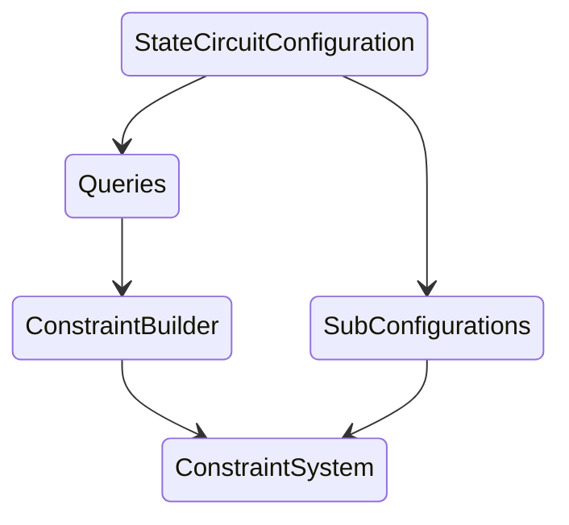

# State Circuit

code: https://github.com/scroll-tech/zkevm-circuits/blob/develop/zkevm-circuits/src/state_circuit.rs `develop` branch.

### EVM's read-write operations and the `rw_table`

During execution, all of the EVM's read-write operations are recorded in `rw_table`, with an order sorted by a counter variable `rw_counter`. Each row of `rw_table`, a.k.a. `RwRow`, contains the following items as table columns:

- `RwRow`
   - `rw_counter`
   - `is_write`
   - `tag`
   - `id`
   - `address`
   - `field_tag`
   - `storage_key`
   - `value`
   - `value_prev`
   - `aux1`
   - `aux2`

Since there are different types of EVM read-write operations, the above `RwRow` items may carry different types of information. Types of rw operations include:
- Start
- TxAccessListAccount 
- TxAccessListAccountStorage
- TxRefund 
- Account 
- AccountStorage
- AccountDestructed
- CallContext
- Stack
- Memory
- TxLog
- TxReceipt

The `tag` column (RwTable Tag) in the `rw_table` is used to specify the above rw type. So an `rw_table` might have the following rows listed below:

|rw_counter (usize)|is_write (bool)|tag (RwTableTag)|id (usize)|address (Address, 20bytes)|field_tag (u64)|storage_key (word)|value (field element)|value_prev|aux1|aux2|
|-|-|-|-|-|-|-|-|-|-|-|
|rw_counter|false|RwTableTag::Start|None|None|None|None|0|None|0|None|
|rw_counter|is_write|RwTableTag::TxAccessListAccount|tx_id|account_address|None|None|is_warm|is_warm_prev|0|None|
|rw_counter|is_write|RwTableTag::TxAccessListAccountStorage|tx_id|account_address|None|RLC storage_key in le bytes|is_warm|is_warm_prev|0|None|
|rw_counter|is_write|RwTableTag::TxRefund|tx_id|None|None|None|value|value_prev|0|None|
|rw_counter|is_write|RwTableTag::Account|None|account_address|AccountFieldTag::{Nonce, Balance, CodeHash, NonExisting}|None|value or RLC value's le bytes if AccountFieldTag == {CodeHash, Balance}|value_prev or RLC value_prev's le bytes if AccountFieldTag == {CodeHash, Balance}|0|None|
|rw_counter|is_write|RwTableTag::AccountStorage|tx_id|account_address|None|RLC storage_key in le bytes|RLC value's le bytes|RLC value_prev's le bytes|only used for AccountStorage::tx_id which moved to key1, but actually the current code assigns 0|RLC committed_value's le bytes|
|rw_counter|is_write|RwTableTag::AccountDestructed|None|account_address|None|None|is_destructed|is_destructed_prev|0|None|
|rw_counter|is_write|RwTableTag::CallContext|call_id|None|CallContextFieldTag::{RwCounterEndOfReversion, CallerID, TxID, Depth, CallerAddress, CalleeAddress, CallDataOffset, CallDataLength, ReturnDataOffset, ReturnDataLength, Value, IsSuccess, IsPersistent, IsStatic, LastCalleeID, LastCalleeReturnDataOffset, LastCalleeReturnDataLength, IsRoot, IsCreate, CodeHash, ProgramCounter, StackPointer, GasLeft, MemorySize, ReversibleWriteCounter}|None|value or RLC value's le bytes if CallContextFieldTag == {CodeHash, Value}|None|0|None|
|rw_counter|is_write|RwTableTag::Stack|call_id|stack_pointer to big endian bytes last 20 bytes as address|None|None|RLC value's le bytes|None|0|None|
|rw_counter|is_write|RwTableTag::Memory|call_id|memory_address|None|None|byte|None|0|None|
|rw_counter|is_write|RwTableTag::TxLog|tx_id|(index, field_tag, log_id) built into tx_log address|TxLogFieldTag::{Address, Topic, Data}, it is None in actual table and field tag info enters address|None|value or RLC value's le byte if TxLogFieldTag == {Topic}|None|0|None|
|rw_counter|is_write|RwTableTag::TxReceipt|tx_id|None|TxReceiptFieldTag::{PostStateOrStatus, LogLength, CumulativeGasUsed}|None|value|None|0|None|

The actual layout of the `rw_table` consists of the above types of rows listed with respect to the increasing order of `rw_counter`, with an additional fixed column `q_enable`. By looking up into the `rw_table`, the EVM Circuit can check the correctness of read-write operations during execution.

### The Purpose of the State Circuit 

State Circuit aims to prove that the `rw_table` is formed correctly. This results in many miscellaneous constraints. They can be mainly classified into the following categories:

- General constraints. 
    - Example: some of the items such as `is_write` shall be boolean, etc.
- The correctness of each of the above form of read-write records as classified by `tag`. 
    - Example: constraints for `start`, `memory`, `stack`, `account_storage`, etc.
- Constraints enforced by sub-configurations. These sub-configurations will be discussed in the next two sections on State Circuit Layout and Architecture & Design.
    - Example: `MpiChip` constrains  the correct decomposition of a multiple-precision-integer into limbs with each limb in u16. This is applied to `rw_counter`, `address`, `id`.


### Circuit Layout

State Circuit is configured as a  constraint system through various smaller gadgets and chips, where each gadget or chip may consist of Halo2 columns (fixed or advice) or even smaller gadgets or chips. Due to this reason, although we can think of the State Circuit layout in a geometric way as horizontally aligned regions of columns belonging to each of its sub-configurations, it may be better to think in a hierarchical way (tree-like structure). In the below, we describe this hierarchy through the configuration of State Circuit, where each sub-configuration at its smallest gratuity of bifurcation lands in some column of the circuit layout (one can click the interior nodes of the hierarchy tree below to expand/contract the next level):

```markmap
# State Circuit Configuration
## selector
- a fixed column
## rw_table
### q_enable
- a fixed column
### RwRow 
- rw_counter (advice column)
- is_write (advice column)
- tag (advice column)
- ...
## sort_keys
### SortKeysConfig
#### tag
##### BinaryNumberConfig
- advice columns for binary bits
- ...
#### id
##### MpiConfig
- advice columns for multiple-precision-integer limbs
- ...
#### address
##### MpiConfig
- advice columns for multiple-precision-integer limbs
- ...
#### field_tag
##### an advice column
#### storage_key
##### RlcConfig
- advice columns for RLC le bytes
- ...
#### rw_counter
##### MpiConfig
- advice columns for multiple-precision-integer limbs
- ...
## initial_value
- an advice column
## is_non_exist
### BatchedIsZeroConfig
#### is_zero 
- an advice column
#### nonempty_witness
- an advice column
## mpt_proof_type
- an advice column
## state_root
- an advice column
## lexicographic_ordering
### LexicographicOrderingConfig
- selector (fixed column)
- limb_difference (advice column)
- limb_difference_inverse (advice column)
#### first_different_limb
##### BinaryNumberConfig
- advice columns for binary number bits 
- ...
## not_first_access
- an advice column
## lookups
### LookupsConfig
- u8 (a fixed column for checking range in u8)
- u10 (a fixed column for checking range in u10)
- u16 (a fixed column for checking range in u16)
- call_context_field_tag (a fixed column)
## mpt_table
- columns of mpt_table
- ...
```

Besides the above, State Circuit's configuration also carries `power_of_randomness` which is for RLC of bytes for `storage_key`.

The numbers of columns used for the sub-configurations are set as parameters/hard coded inside State Circuit. From there and the above hierarchy, the total number of columns in the State Circuit layout can be easily calculated.

Here 
- `initial_value` is the Assigned value at the start of the block. For `Rw::Account` and `Rw::AccountStorage` rows this is the committed value in the MPT, for others, it is 0;
- `mpt_proof_type` is used to identify the `MPTProofType` (see MPT Circuit);
- `is_non_exist` is used to identify whether we need to do lookup for non-existence type MPT proof such as `MPTProofType::AccountDoesNotExist` or `MPTProofType::StorageDoesNotExist`;
- `not_first_access` is false when at least one of the keys `(tag, id, address, field_tag, storage_key)` in the current row differs from the previous row, otherwise it is true;
- `state_root` is the RLC value of the little-endian bytes of the old state root before the change to MPT. 

For other sub-configurations and columns listed in the above hierarchy tree, we will explain them in the section below about circuit design and code architecture. 


### Architecture and Design 

#### Workflow

Above the columns in the State Circuit layout (via State Circuit's Configuration), an additional layer `Queries` that contains witness data is built. The `ConstraintBuilder` will take data from `Queries` to establish constraints for each type of `tag` in `rw_table`. In addition, the sub-configurations are sometimes based directly on witnesses provided by State Circuit's Configuration. These two parts of constraints combine together to establish the constraint system for the State Circuit. So we have the following design of State Circuit's workflow:



#### Queries
We illustrate the `Queries` data structure as below:
- `Queries`
    - `selector`: this is the `selector` from State Circuit's configuration
    - `rw_table`: `RwRableQueries`, this follows from `rw_table` and adds some previous data. It includes the following items: `rw_counter`, `prev_rw_counter`, `is_write`, `tag`, `id`, `prev_id`, `address`, `prev_address`, `field_tag`, `storage_key`, `value`, `value_prev`
    - `mpt_update_table`: `MptUpdateTableQueries`, this is the same as in MPT table. It includes the following items: `address`, `storage_key`, `proof_type`, `new_root`, `old_root`, `new_value`, `old_value`
    - `lexicographic_ordering_selector`: this is the selector column for the `lexigoragphic_ordering` chip
    - `rw_counter`: `MpiQueries`, this is the query for `multiple_precision_integer` chip. It contains the limbs with number = `N_LIMBS_RW_COUNTER` and the previous limbs
    - `tag_bits`: the 4-bit representation for the `tag` column in `rw_table` 
    - `id`: `MpiQueries`, limbs and previous limbs for `id` with number = `N_LIMBS_ID`
    - `is_tag_and_id_unchanged`: this isn't binary! only 0 if most significant 3 bits are all 0 and at most 1 of the two least significant bits is 1
    - `address`: `MpiQueries`, limbs and previous limbs for `address` with number = `N_LIMBS_ACCOUNT_ADDRESS`
    - `storage_key`: `RlcQueries`, this is the query for `random_linear_combination` chip. It contains the bytes for `storage_key` with number = `N_BYTES_WORD`
    - `initial_value`: this is the `initial_value` from State Circuit's configuration
    - `initial_value_prev`: this is the previous `initial_value` from State Circuit's configuration
    - `is_non_exist`: this is the `is_non_exist` from State Circuit's configuration
    - `mpt_proof_type`: this is the `mpt_proof_type` column from State Circuit's configuration
    - `lookups`: this is the query for the `Lookup` chip with range check columns for `u8`, `u10`, `u16` and `call_context_field_tag`
    - power_of_randomness: this is the `power_of_randomness` from State Circuit's configuration for `storage_key`'s RLC bytes
    - first_different_limb
    - not_first_access: this is the `not_first_access` column from State Circuit's configuration
    - `last_access`: if next row is first access, this is 1, else it is 0
    - `state_root`: current state root from State Circuit's configuration
    - `state_root_prev`: previous state root from State Circuit's configuration


#### Constraint Builder

State Circuit's `constraint_builder` takes in `Queries` and then builds a constraint system for each type of `tag` in the `rw_table`, as well as general constraints and range lookups from the `lookups` sub-configuration. 

#### Sub-configurations of State Circuit

As we have illustrated in the circuit layout section, State Circuit uses sub-configurations that are based on the following gadgets/chips:

##### multiple_precision_integer (MpiChip)

This chip helps to check the correct decomposition of a multiple-precision-integer into limbs with each limb in u16. The number of advice columns used in this chip is set to be the desired number of limbs. In State Circuit, this chip is applied to the following sub-configurations as `MpiConfig`:

- `rw_counter`: number of limbs is `N_LIMBS_RW_COUNTER` (currently set to be 2);
- `address`: number of limbs is `N_LIMBS_ACCOUNT_ADDRESS` (currently set to be 10);
- `id`: number of limbs is `N_LIMBS_ID` (currently set to be 2).

##### BinaryNumberChip
This chip helps to check the correct decomposition of a binary number into an array of bits. The number of advice columns used in this chip is set to be the desired number of bits. In State Circuit, this chip is applied to the following sub-configurations as `BinaryNumberConfig`:

- `tag`: number of bits is hard-coded as 4.

##### random linear combination (RlcChip)
This chip helps to check the Random Linear Combination of given bytes, which are from little-endian byte decomposition of U256. The number of advice columns used in this chip is set to be the number of bytes used in RLC. In State Circuit, this chip is applied to the following sub-configurations as `RlcConfig`:
- `storage_key`: number of bytes is `N_BYTES_WORD` (currently set as 32).

##### lexicographic_ordering

This chip helps to check the increasing order of a list of 512-bit values `X`, i.e, `X_curr > X_prev`. This is applied to packing the following 6 fields `(tag, id, address, field_tag, storage_key, rw_counter)` in the order of big-endian limbs, so that the rows of the rw table are in lexicographic order sorted by these fields.

##### lookups (LookupsChip)
This is a helper chip that does range checks in u8, u10, u16 and `call_context_field_tag`. It is used frequently in various places of State Circuit including constraint builder and chips for sub-configurations.

##### BatchedIsZeroChip
This chip helps to check a list of values are all 0. This is applied to check whether we need a mpt proof type `MPTProofType::AccountDoesNotExist` or `MPTProofType::StorageDoesNotExist` (so that `is_non_exist` is true). The rationale is that when `field_tag` is `AccountFieldTag::CodeHash`, then if both `initial_value` (in State Circuit's configuration) and `value` (in `rw_table`, which also belongs to the State Circuit configuration) are 0, we need set `mpt_proof_type` (a column in State Circuit's configuration) to be of non-existence type.


### Constraints

Since there is a large number of misallenous constraints in the State Circuit, here we'll only take one example to give the reader an impression of the style of constraints in State Circuit. 

We discuss <b>account constraints</b>, which are established in the `ConstraintBuilder`. 

#### AccountConstraints

- basic constraints
    - `id` is 0 (None)
    - `storage_key` is 0 (None)
    - `field_tag` is one of Account Field Tags including `AccountFieldTag::{Nonce, Balance, CodeHash, NonExisting}`

- constraints related to `mpt_proof_type` 
    - if account does not exist, i.e., `is_non_exist` is true and `fieldTag==AccountFieldTag::CodeHash`, then `mpt_proof_type` is `AccountDoesNotExist`
    - else, `mpt_proof_type` is the same as `field_tag` (with name changed from say `Nonce` to `NonceChanged`, `CodeHash` to `CodeHashExists` etc. , see [here](https://github.com/scroll-tech/zkevm-circuits/blob/700e93c898775a19c22f9abd560ebb945082c854/zkevm-circuits/src/table.rs#L645))

- constraints related to mpt update at the last access to Account's read-write
    - lookup of `(address, storage_key, mpt_proof_type, state_root, state_root_prev, value, initial_value)` into `mpt_update_table`'s `(address, storage_key, new_root, old_root, new_value, old_value)`

- constraints of `value_prev` 
    - `value_prev` must be the same as `value` in the previous row unless `is_non_exist`
